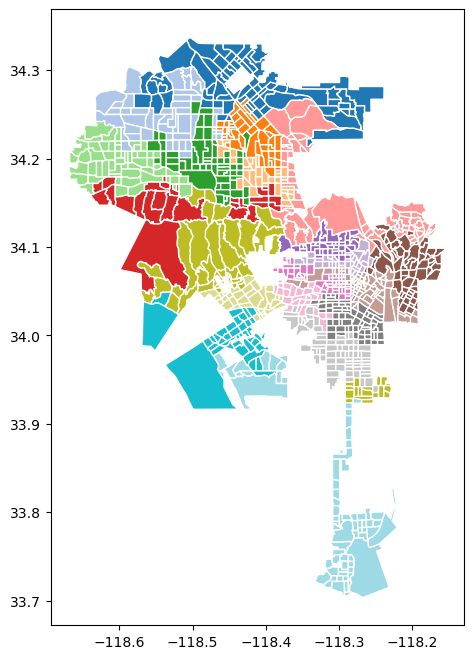

# Expressive Max-P-regions Notebook for CyberGISX

Spatial regionalization is the process of grouping a set of spatial areas into spatially contiguous and homogeneous regions. This paper introduces an enriched max-p-regions (EMP) problem; a regionalization process that allows enriched user-defined constraints based on SQL aggregate functions. In addition to enabling richer constraints, it enables users to employ multiple constraints simultaneously to significantly push the expressiveness and effectiveness of the existing regionalization literature. The EMP problem is NP-hard and significantly enriches the existing regionalization problems. Such a major enrichment introduces several challenges in both feasibility and scalability. To address these challenges, we propose the FaCT algorithm, a three-phase greedy approach that finds a feasible set of spatial regions that satisfy EMP constraints while supporting large datasets compared to the existing literature. Our extensive experimental evaluation has demonstrated the effectiveness and scalability of our techniques on several real datasets.

